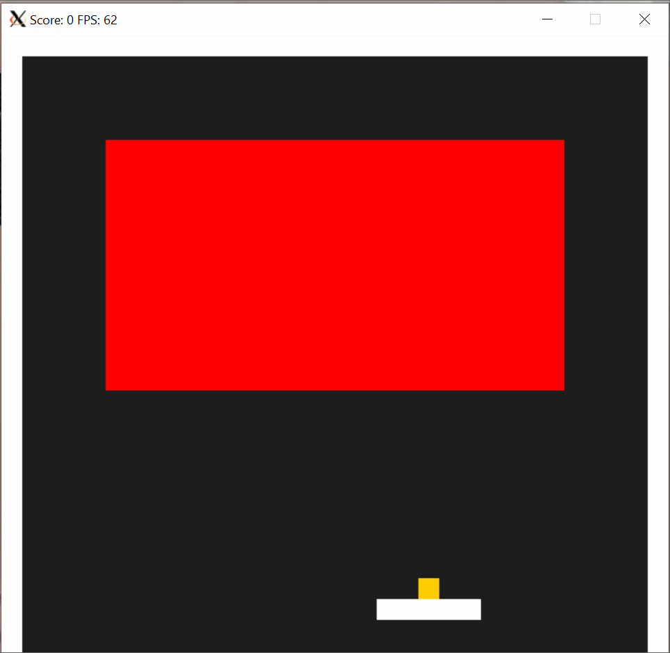
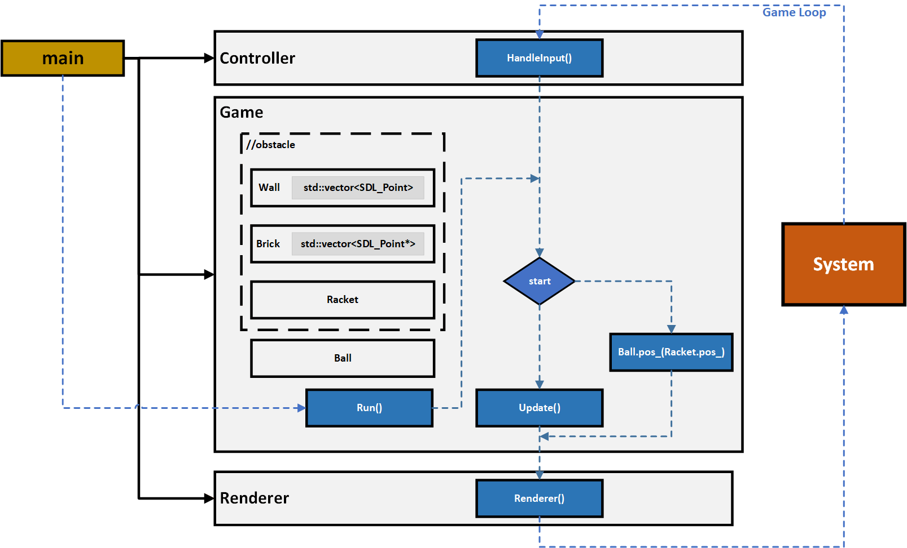

# Brick Breaker Game
Game where player control the racket to keep the ball bounces on top of it until the all brick break. The code used [this repo](https://github.com/udacity/CppND-Capstone-Snake-Game) as the framework to build the game. 

## Dependencies for Running Locally
* cmake >= 3.7
  * All OSes: [click here for installation instructions](https://cmake.org/install/)
* make >= 4.1 (Linux, Mac), 3.81 (Windows)
  * Linux: make is installed by default on most Linux distros
  * Mac: [install Xcode command line tools to get make](https://developer.apple.com/xcode/features/)
  * Windows: [Click here for installation instructions](http://gnuwin32.sourceforge.net/packages/make.htm)
* SDL2 >= 2.0
  * All installation instructions can be found [here](https://wiki.libsdl.org/Installation)
  * Note that for Linux, an `apt` or `apt-get` installation is preferred to building from source.
* gcc/g++ >= 5.4
  * Linux: gcc / g++ is installed by default on most Linux distros
  * Mac: same deal as make - [install Xcode command line tools](https://developer.apple.com/xcode/features/)
  * Windows: recommend using [MinGW](http://www.mingw.org/)

## Basic Build Instructions

1. Clone this repo.
2. Make a build directory in the top level directory: `mkdir build && cd build`
3. Compile: `cmake .. && make`
4. Run it: `./Game`

## Control

`←` (left_key) turn racket left

`→` (right_key) turn racket left

`↑` (up_key) launch the ball to start breaking!

## Code description

The program work with a typical game loop application. It consists of five classes: `Game`, `Ball`, `Racket`, `Controller`, and `Renderer`. The image above shows the workflow of the code:

1. `main` creates `Controller`, `Game`, `Renderer`. `Game` has `Racket`, `Wall`, `Brick` and `Ball` in which the first four contains vector of points where the `Ball` will bounce to (using `Ball::ObstacleExist` and `Ball::UpdateDirection`).
2. `main` calls `Game::Run` to start the game loop. During the main loop inside `Game::Run`, it will have two states where the `Ball`'s position follows `Racket`'s position until the state `start` becomes  `true`.
3. `brick` memory is made dynamic by a vector of `SDL_Point` pointer and will delete its memory once the `Ball` bounce to it. (improvement can be made by `brick` to class)

## Rubric Point addressed

### Loops, Functions, I/O
| Rubric point  | Location |
| ------------- | ------------- |
| The project demonstrates an understanding of C++ functions and control structures.  |   Yes, check all the files
| The project accepts user input and processes the input.| [Controller](src/controller.cpp) and [Racket](src/racket.cpp)

### Object Oriented Programming
| Rubric point  | Location |
| ------------- | ------------- |
| The project uses Object Oriented Programming techniques.  |   Yes, check all the files
Classes use appropriate access specifiers for class members. | Yes, check all the files
Class constructors utilize member initialization lists. | Yes, check all the files
Classes abstract implementation details from their interfaces. | Yes, check all the files
Classes encapsulate behavior. | [Game](src/controller.cpp), [Ball](src/Ball.cpp) and [Racket](src/racket.cpp)

### Memory Management
| Rubric point  | Location |
| ------------- | ------------- |
| The project makes use of references in function declarations.  |   [Game](src/game.cpp) (specifically `std::vector<SDL_Point*> brick`)
The project uses destructors appropriately. | [Game](src/game.cpp) (specifically `std::vector<SDL_Point*> brick`)
